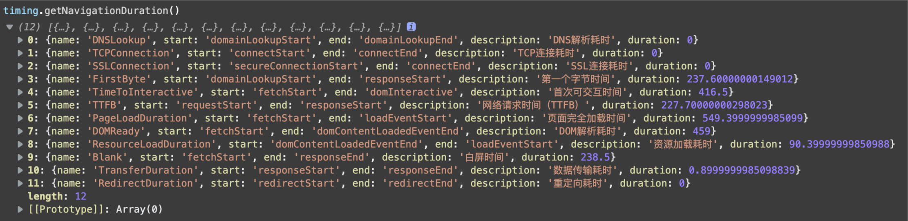
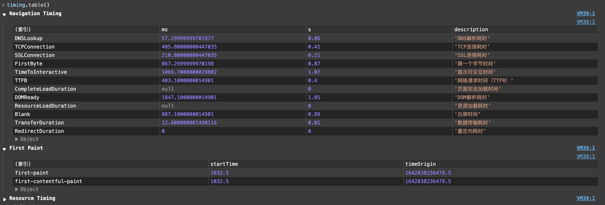

# ptiming
A small tool for working with Web Performance API.

## Installation

```bash
$ yarn add ptiming
```

## Usage

Get measurements:

```javascript
timing.getNavigationDuration();
```



Get paint timing:

```javascript
timing.getPaintTiming();
```

Make a table:

```javascript
timing.table();
```



## License

MIT